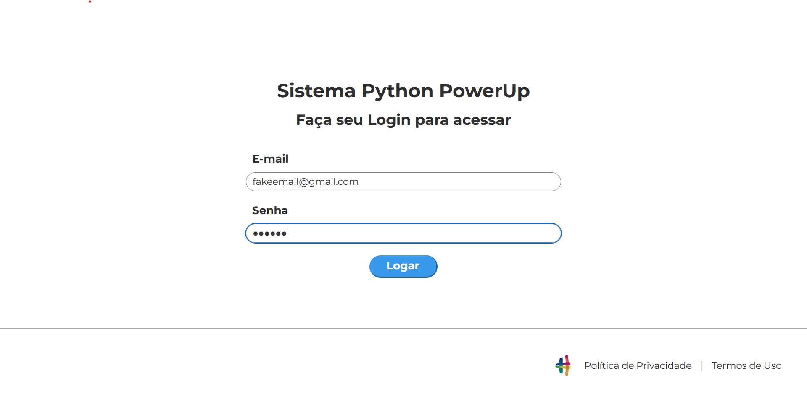
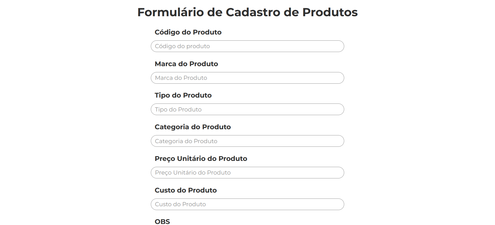

# Automated product register

This project is a Python script that automates the process of logging into a website and registering products. It uses the `pyautogui` library to simulate mouse clicks and keyboard inputs.

#### Login page



#### Product registration form



## Requirements

- Python 3.x
- `pyautogui` library
- `pandas` library
- Chrome browser installed on your device

To install the required libraries, run the following command in your terminal:

```bash
pip install pyautogui
pip install pandas
```

## Usage

Run the script using the following command:

```bash
python main.py
```

## Code Explanation

The script consists of three main functions:

1. `login()`: This function opens a Chrome window and navigates to the login page of the website. It then enters the email and password to log in.
2. `product_registration()`: This function reads a CSV file named "produtos.csv" and registers each product listed in the file. It simulates mouse clicks and keyboard inputs to fill out the registration form.
3. `main()`: This is the main function that calls the `login()` and `product_registration()` functions.

## Known Issues

The script uses absolute coordinates for mouse clicks, which means it might not work correctly on different screen resolutions or if the layout of the website changes. Adjust the coordinates according to your screen resolution and the current layout of the website. You can run the code `python get_position.py` to get the coordinates of your mouse (it will be printed in the terminal)

Also, the script assumes that Chrome is the default browser on your device. If you're using a different browser, you'll need to modify the script accordingly.

## Advice

- Make sure to handle exceptions in your code to prevent unexpected crashes.
- Consider using relative coordinates instead of absolute ones for more robust automation.
- Test your script thoroughly on all target devices to ensure compatibility.

---

Please let me know if you need any changes or additions to this README file.
